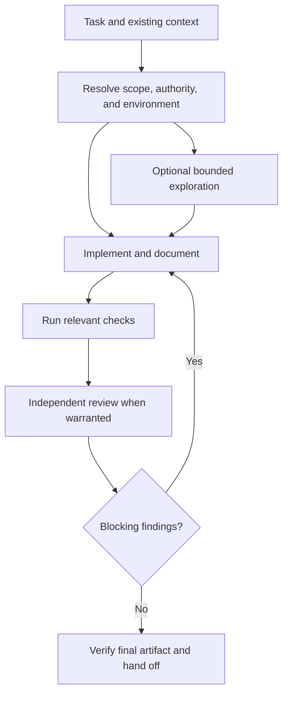

# Report 2: Redesign ca77y around Codex app and GPT capabilities

Review date: 2026-09-05. Repository baseline: `30562c84126a126437e5713f1e41e37498f278d9`. This is an architectural proposal, separate from the compatibility-preserving cleanup in [Report 1](/Users/catty/Workspace/agentic-codex/docs/reports/2026-09-05-existing-system-improvements.md). It has not been implemented or benchmarked.

**Recommendation: make the main Codex agent responsible for completing the task, and delegate bounded work when isolation, independent judgment, or parallelism justifies it.** Preserve explicit authority, acceptance evidence, and research provenance. Replace the mandatory sequence of organizational roles with a small set of outcome-oriented workflows and optional specialists.

The current system gives a capable main agent the administrative job of routing every spec, edit, check, and documentation change through another context. That can be useful for demanding work, but applies the same structure to a small fix or prose change. The redesign should scale the process with the task.

## 1. What the platform actually supports

Official documentation was searched and fetched through the project's required `webtools` MCP server. Some former `developers.openai.com/codex/` pages now serve documentation under `learn.chatgpt.com`; citations below identify the retrieved official pages. Runtime observations refer only to tools exposed in this session, not to guaranteed features in every Codex installation.

| Capability and evidence | Design consequence | Boundary |
|---|---|---|
| Skills load name/description first, with the full skill loaded when selected. Optional `agents/openai.yaml` supports display metadata and invocation policy. [S1] | Short workflow entry points with clear triggers; conditional references for exceptional paths. Use explicit-only invocation metadata for setup or publication workflows where appropriate. | Merely moving text to a reference does not help if the custom-agent compiler embeds it eagerly. |
| Codex supports custom agents, parent model/effort inheritance, continuation, and explicit or skill-authorized delegation. It warns that subagents add token work and concurrent edits add coordination cost. [S2] | Use narrow agents for useful parallel work and independent review. Put the delegation rule in the workflow skill. | A model's ability to delegate does not mean it should spawn on every task. Respect active runtime restrictions. |
| GPT-6 Astra guidance emphasizes sustained work, mid-task steering, sensitivity to skill instructions, and calibrating testing to the change. [S3] | Give it outcomes, constraints, evidence requirements, and stopping rules. Remove instructions that force unnecessary pauses or exhaustive rechecking. | Stronger models can follow a bad rule more consistently; upgrading the model does not repair contradictory policy. |
| Codex app supports worktrees and handoff; new app worktrees may begin detached. [S4] | Inspect and reuse the task's existing checkout. Treat environment and branch state as inputs. | Do not assume the app worktree already has a branch or independently create a second worktree for the same task. |
| Scheduled tasks can return to an existing chat or run independently. Desktop project work requires the machine and app to remain available. [S5] | Optional user-requested review monitoring and library maintenance can use native scheduling. | Do not install always-on polling by default. Web event triggers and desktop local tasks have different availability. |
| This session exposes task reading/continuation, native review/file panels, async user questions, and collaboration tools. | Keep the user in one task; show artifacts and actionable diffs directly; continue independent work while a nonblocking question is pending. | Detect tool availability. The current handoff tool cannot move the calling task itself; a skill cannot promise universal self-handoff. |

Do not introduce an Agents SDK service or Responses API harness simply to use these capabilities. The Codex app already hosts the work. API features such as Structured Outputs, `configuration_update`, or custom asynchronous function execution need an application integration; writing their names in a skill does not enable them.

## 2. Proposed public workflows

Keep **two independently installable plugins**. Engineering delivery and research-library maintenance are useful separately, and engineering should continue working without the library. Reduce internal ceremony before considering a packaging merger.

The following names are proposed plugin workflows, not existing Codex commands.

| Plugin | Workflow | User outcome |
|---|---|---|
| Engineering | `deliver` | Implement or repair a task through the requested endpoint: verified local change, commit, or PR. It also resumes an existing PR. |
| Engineering | `shape` | Turn an idea or evidence into a scoped proposal, recording a card when requested and authorized. |
| Engineering | `setup` | Inspect or configure board/forge bindings and install or check optional specialists. Load only the relevant setup reference. |
| Library | `research` | Answer a substantial research question and persist reusable evidence and synthesis. |
| Library | `ask` | Answer from the existing library with citations, without triggering a deep dive or maintenance pipeline. |
| Library | `maintain` | Audit or repair a selected part of the library, with full-vault review available explicitly. |
| Library | `setup` | Create or safely complete the library scaffold and install/check optional specialists. Obsidian configuration remains optional. |

Provide short compatibility entry points for `lead`, `analyst`, `board`, `forge`, `bootstrap`, `researcher`, and installer invocations during migration. These aliases add temporary catalog entries; seven workflows is the intended end state, not an immediate reduction while aliases remain.

Use app-facing names such as “Deliver a change,” “Shape a proposal,” and “Ask the library.” Descriptions should lead with the user's task, not the internal role or lifecycle. Keep leaf custom-agent manuals under `agents/<role>/AGENT.md` as repository rules require.

## 3. Engineering: one owner, selective specialists

The main agent owns understanding, implementation, tests, docs, coordination, and the authorized handoff. It may delegate parts but remains able to do the work. Endpoints follow user intent and project write authority; invoking a generic help request must not silently imply publication.



Adopt three operating paths with qualitative triggers instead of a model-routing score:

| Path | Trigger | Procedure |
|---|---|---|
| Small change | Clear, bounded, low-impact edit with established behavior | Main agent implements and checks; no mandatory spec file or specialist. Respect any project-required independent review. |
| Standard delivery | A feature or bug requiring meaningful behavior changes | Short durable plan when needed; implementation, tests, and docs; one independent review covering correctness and acceptance. |
| High-risk delivery | Security, migrations, public contracts, complex integration, or substantial unresolved design | Written design; independent pre-build challenge; implementation; focused test work as useful; independent final review. |

Only two engineering custom roles are initially necessary:

- **Implementer:** owns a bounded subsystem when the main agent has useful independent work. It can implement and test that subsystem, so trivial fixes do not bounce between coder and QA. Never delegate the whole task merely to keep the main agent from editing.
- **Reviewer:** independently inspects the final candidate for correctness, acceptance coverage, regressions, and material missing tests. Its default is report-only. For high-risk work, it can separately challenge the design before implementation.

The writer's work becomes an activity performed by the owner or implementer. The auditor's acceptance lens and QA's correctness lens become explicit sections of one reviewer contract. Keep them separable as review dimensions, and split into additional independent reviews only when the task merits it.

Make access match the role where the host supports it. Today's compiler emits only name, description, and instructions; “no board access” and “report-only” are therefore behavioral instructions, not tool isolation. A reviewer can use an appropriate read-only configuration and reduced tool surface, but verify effective permissions: Codex runtime overrides can take precedence over custom-agent defaults. [S2] Do not present a prose prohibition as an enforced security boundary.

Use `spawn_agent` for a new custom role, `followup_task` to continue a worker holding useful context, `send_message` for timely coordination, and `wait_agent` for completion. A final report remains the completion artifact; a mid-run warning is not prohibited just because it arrives through a message. A review can start fresh for independence, while a narrowly scoped recheck can continue the same reviewer. Require a fresh final review again if the approach materially changes.

### Evidence instead of ceremony

Every relevant acceptance item needs a source and evidence. Keep a small table: criterion → observation/test → candidate revision → result. Do not require a full spec with several parallel representations of the same requirement for every task.

Tests should detect meaningful regressions. Demonstrate a regression test on the failing baseline when feasible, preferably before the fix or in an isolated checkout. Routine documentation and naming changes need appropriate inspection or existing checks, not artificial per-sentence test files. After checks pass, repeat them only when the candidate changes or evidence leaves a relevant concern unresolved. This follows the calibration recommended for Astra. [S3]

Documentation belongs in the candidate before final review. A later code, config, or behavioral-doc change invalidates affected evidence; rerun the checks and review portions it affects. A passed gate never grants permanent clearance to later edits.

## 4. App workspace and recovery design

Use the environment in which the task is already running. Inspect the git root, worktree identity, branch/detached state, and working changes. Reuse a suitable app worktree. For a local checkout that needs isolation, follow the user's requested environment and available app controls or the project's permitted git operations. Do not automatically create a new sidebar task; separate user-owned tasks require an explicit request.

Keep a **small durable run record only for work that needs recovery**, rather than requiring a detailed ledger before every wait. Store it in a project-approved location whose lifecycle is documented. Suggested fields:

```text
Objective and requested endpoint
Scope and acceptance source/version
Checkout, branch, and candidate revision
Changes owned by this run
Verification evidence and invalidated checks
Open findings and decisions needed
Existing PR/card identifiers
Next action
```

Save after consequential transitions, before yielding unfinished work, and before handing off. Treat worker IDs as optional resumable handles; verify their availability rather than making recovery depend on them. Recover from the tree, commits, and PR when handles disappear.

Ignored files do not necessarily move through app handoff. [S4] Therefore, do not put the only copy of the scope or verification record in disposable worktree scratch. Preserve the useful plan in the PR/commit history or another durable project artifact and keep exact recovery instructions. Small local fixes may need only the conversation and git diff.

Commits should form coherent reviewable changes. Do not require spec/build/round/ship commits solely to pass state between agents. Reviewers can inspect an explicit base revision and the candidate diff. Commit checkpoints remain useful for long work and recovery, but the task should determine their boundaries.

Retain `BOARD.md` and `FORGE.md` initially. Read bindings when an operation needs them. A missing publication binding should prevent that publication operation, while permitting already-authorized investigation and preparation. This is a deliberate behavior change from today's missing-forge hard stop and must be tested and documented.

## 5. Model selection and prompting

**Default to the user's selected main model and inherited worker settings.** The current host exposes GPT-6 Astra and the GPT-5.6 Sol/Terra/Luna family. These are candidates, not a universal ranking or a reason to override user choice. Official subagent documentation supports inheritance and configured model selection. [S2]

Separate role identity from execution profile. If the user wants cost or latency control, offer one centrally defined policy, for example:

| Work | Candidate policy to evaluate |
|---|---|
| Ambiguous cross-system delivery | Selected main model; compare Astra and Sol on representative tasks |
| Narrow extraction or repetitive transformation | Evaluate Terra/Luna only with clear boundaries and verifiable outputs |
| Material independent review | Use a model/effort proven on defect-detection fixtures; do not automatically downgrade this with all other work |
| Mechanical equality, link checks, YAML parsing | Deterministic code |

Do not hardwire `xhigh` merely because a role is called junior or librarian. Measure the cost of producing an accepted result, including repair rounds, rather than per-token price or first response speed. Keep exact model IDs in one supported profile map, validate combinations against the host, and surface unavailable selections instead of silently changing them.

The existing `--fast` means a different model tier with unchanged effort; it is not the platform's processing-speed feature. Preserve the old behavior only in the compatibility workflow, and give any new preference a name that clearly describes cost or latency intent.

For each workflow, instructions should answer five questions: what outcome to produce, what context to read, what is in scope, what evidence establishes completion, and when to stop or ask. Use a handful of concrete examples for tricky cases. Remove universal “never” rules that only compensate for one historical incident; preserve the underlying invariant and place the incident in an evaluation fixture.

## 6. Library: direct research and a single writer

The library can keep its current plain-file storage, raw sources, wiki, and provenance. Its core benefit does not require a multi-stage crew on every run.

The main research workflow retrieves existing knowledge directly, conducts the investigation, and writes evidence and synthesis. For broad topics it delegates independent source questions to a **researcher** custom agent. Children return cited findings and may write uniquely assigned raw notes; one owner writes the final wiki and shared metadata.

A second optional custom role, **evidence reviewer**, checks consequential claims, contradictions, citation support, and uncertainty. Existing scribe and librarian procedures become workflow references for direct use. Clerk's mechanical checks become a validator; its judgment checks become the evidence review or an explicit maintenance workflow. This reduces nine combined custom-agent definitions to four in the proposed core: implementer, reviewer, researcher, and evidence reviewer.

Batch persistence at meaningful checkpoints. Preserve source URL, access date, quoted evidence, and uncertainty. Always distinguish retrieved facts, inference, and product decisions. A failed search proves a retrieval limitation, not that a capability does not exist. Honor the configured research provider; for this project that is `webtools`.

A validator should report frontmatter failures, missing pages/anchors, unregistered tags, and unresolved internal links. Semantic review decides whether a cited passage actually supports a claim. Audit touched pages and their affected references by default, with full-library maintenance on explicit request. Optional scheduled maintenance uses native automation only when the user asks; the library remains useful without it.

## 7. Benefits and tradeoffs to test

| Dimension | Existing design | Proposed design | Expected benefit and cost |
|---|---|---|---|
| Small-task overhead | Six worker dispatches on the standard delivery happy path | Zero mandatory workers for small changes | Less waiting and repeated context; main agent must own its verification discipline |
| Standard feature | Separate spec, readiness, code, QA, acceptance, docs workers | Main owner plus one reviewer; extra workers only for independent work | Fewer handoffs and repeated readings; one reviewer must explicitly cover both correctness and acceptance |
| High-risk work | Same fixed role chain, repeated as findings recur | Design challenge plus final review, with focused specialists where useful | Preserve independence while matching effort to risk; classification needs evaluation |
| Model use | Roles force fixed model/effort values | Inherit by default, explicit measured profiles | Respects app selection and avoids duplicated model tables; cost optimization needs empirical data |
| Recovery | Detailed scratch ledger and mandatory spec lifecycle | Compact durable record plus actual tree/PR state | Fewer synchronization points and a clear repair path; state placement must survive handoff |
| Library | Librarian, repeated scribe calls, full ingest, clerk cycle | Direct owner, batch persistence, mechanical lint, optional evidence review | Lower orchestration overhead; enforce one writer for shared metadata |
| Maintenance | Repeated exception-heavy prose | Short contracts, conditional references, targeted checks and fixtures | Easier updates; deterministic helpers introduce a small code maintenance burden |

Moving a standard task from six workers to one or two means four or five fewer worker starts. That arithmetic is clear; the percentage reduction in wall time, tokens, or price is unknown. Stronger models may do more work in the main context, and review findings may change the total. Measure it.

The main risk is correlated mistakes when the same agent designs and builds. Preserve independent review for substantive changes and design challenge for high-risk work. Conversely, more agents are not automatically more independent: several roles can all inherit the same mistaken spec. Evaluate reviewers against planted mistakes rather than counting role names.

## 8. Migration and acceptance experiment

1. Apply Report 1's correctness fixes and establish baseline task measurements.
2. Prototype `deliver` alongside the current lead, preserving the old workflow as an explicit choice. Start with local tasks; retain existing publication authority.
3. Move main-agent implementation and combined final review into the prototype. Add model profiles only after inherited defaults have a baseline.
4. Prototype direct library research with single-writer persistence and the validator. Preserve raw files and existing links.
5. Add setup wrappers, app metadata, installed-agent parity checks, and aliases. Keep the managed installer until a verified supported distribution mechanism replaces it; do not assume plugin manifests install custom agents.
6. Promote the redesign only after it meets the criteria below. Removing roles/public names is a major-version change, not a patch. Roll back by selecting the old workflow; avoid destructive library migration.

Evaluate a corpus spanning small fixes, documentation-only edits, multi-file features, dependency failures, public-contract changes, stale cards, PR repair after worktree loss, concurrent edits, interrupted runs, simple library retrieval, broad research, and unavailable sources. Run each against the same starting tree and task, with repeated trials for variability.

Record accepted outcomes, serious defects missed, unnecessary pauses, out-of-scope edits, verification coverage, worker starts, retries, wall time, actual token/usage measurements where available, and recovery success. Include scenario-specific checks for the contract gaps in Report 1.

Acceptance should require **no missed seeded critical defects**, no unauthorized writes, successful recovery cases, preserved source provenance, and a meaningful reduction in median completion time or usage on small/standard work. Set the numerical performance target after baseline measurement. Do not trade correctness for a prettier agent diagram.

## Sources

- **S1:** [Build skills](https://learn.chatgpt.com/docs/build-skills) — progressive disclosure, descriptions, invocation policy, UI metadata, and instruction-versus-script guidance.
- **S2:** [Subagents](https://learn.chatgpt.com/docs/agent-configuration/subagents) — custom agents, inheritance, orchestration, context isolation, token overhead, and concurrent-write cautions.
- **S3:** [Model guidance: GPT-6 Astra](https://learn.chatgpt.com/api/docs/guides/latest-model) — autonomy, instruction sensitivity, steering, delegation, and calibrated verification. API-specific features are not assumed to be plugin controls.
- **S4:** [Worktrees](https://learn.chatgpt.com/docs/environments/git-worktrees) — app worktree lifecycle, detached HEAD, handoff, and ignored-file behavior.
- **S5:** [Scheduled tasks](https://learn.chatgpt.com/docs/automations) — recurring work, same-chat versus independent runs, local availability requirements, and surface-specific event support.

All five official pages were fetched on 2026-09-05 using `webtools`. Current-session tool schemas provide the additional evidence for task panels, async questions, and the calling-task handoff restriction. Model availability and app surfaces may vary by host; this proposal does not establish pricing or account entitlement.
